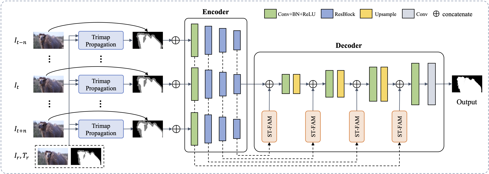

#  Deep Video Matting via Spatio-Temporal Alignment and Aggregation [CVPR2021]
---

Paper: [https://arxiv.org/abs/2104.11208](https://arxiv.org/abs/2104.11208)

### Introduction

Despite the significant progress made by deep learning in natural image matting, there has been so far no representative work on deep learning for video matting due to the inherent technical challenges in reasoning temporal domain and lack of large-scale video matting datasets. In this paper, we propose a deep learning-based video matting framework which employs a novel and effective spatio-temporal feature aggregation module (ST-FAM). As optical flow estimation can be very unreliable within matting regions, ST-FAM is designed to effectively align and aggregate information across different spatial scales and temporal frames within the network decoder. To eliminate frame-by-frame trimap annotations, a lightweight interactive trimap propagation network is also introduced. The other contribution consists of a large-scale video matting dataset with groundtruth alpha mattes for quantitative evaluation and real-world high-resolution videos with trimaps for qualitative evaluation. Quantitative and qualitative experimental results show that our framework significantly outperforms conventional video matting and deep image matting methods applied to video in presence of multi-frame temporal information.

### Framework



### Environment
- torch==1.11.0
- torchvision==0.12.0
- visdom
- kornia
- tfrecord
- pillow
- scipy
- scikit-image
- prefetch_generator
- dominate
- deform_conv. Install deform_conv using the following command.
```
cd dcn
python setup.py install
```


### Dataset

We composite foreground images and videos onto high-resolution background videos to generate large-scale video matting training/testing dataset. Follow the steps to prepare the datasets. The structure is as the following.

```
DVM
  ├── fg
    ├── image
      ├── train
        ├── alpha
          ├── xxx.png
          ├── yyy.png
          ├── ...
        ├── fg
          ├── xxx.png
          ├── yyy.png
          ├── ...
      ├── test
        ├── alpha
          ├── xxx.png
          ├── yyy.png
          ├── ...
        ├── fg
          ├── xxx.png
          ├── yyy.png
          ├── ...
        ├── trimap
          ├── xxx.png
          ├── yyy.png
          ├── ...
    ├── video
      ├── train
        ├── 0000
          ├── a.mp4
          ├── f.mp4
        ├── ...
      ├── test
        ├── 0000
          ├── a.mp4
          ├── f.mp4
        ├── ...
  ├── bg
    ├── train
      ├── 0000.mp4
      ├── 0001.mp4
      ├── ...
    ├── test
      ├── 0000.mp4
      ├── 0001.mp4
      ├── ...
```

 

1. Please contact Brian Price (bprice@adobe.com) for the Adobe Image Matting dataset.

2. Put training fg/alpha images and testing fg/alpha/trimap images from Adobe dataset in the corresponding directories.

3. Download training/testing videos and place them in the corresponding directories. 

   Link: https://pan.baidu.com/s/1yBJr0SqsEjDToVAUb8dSCw  Password: l9ck

4. Use `data/process.py` to generate training/testing datasets. About 1T storage is needed.

5. We use tfrecord format in training and testing for speedup. Please run the following command to generate tfrecord files.
```
# generate training tfrecord files
python tools/write_tfrecords.py \
    -i datasets/composition_train/ \
    -o datasets/composition_train_tf \
    -m vfba \
    -s write \

# generate testing tfrecord files
python tools/write_tfrecords.py \
    -i datasets/composition_test/ \
    -o datasets/composition_test_tf \
    -m vfba \
    -s write \

# check training tfrecord files
python tools/write_tfrecords.py \
    -i datasets/composition_train/ \
    -o datasets/composition_train_tf \
    -m vfba \
    -s check \

# check testing tfrecord files
python tools/write_tfrecords.py \
    -i datasets/composition_test/ \
    -o datasets/composition_test_tf \
    -m vfba \
    -s check \

```


### Code
###### Training
Run the following command to train the model on the composited video datasets. Download the pretrained backbone model [here](https://drive.google.com/file/d/1KXQlzqw8HOz3Zr0gK6-HTOaEE39rL0GX/view?usp=sharing).
```
python train.py \
  --dataroot datasets/composition_train_tf \
  --dataroot_val datasets/composition_test_tf \
  --checkpoints_dir checkpoints \
  --dataset_mode tfrecord \
  --max_n_chunk 1 \
  --name dvm \
  --model matting \
  --add_refine_stage \
  --comp_loss \
  --comp_weight 0.5 \
  --grad_loss \
  --kld_loss \
  --temp_loss \
  --refine_loss \
  --niter 20 \
  --niter_decay 80 \
  --n_frames 2 \
  --shift 2 \
  --batch_size 1 \
  --num_threads 8 \
  --frame_loading chunk \
  --load_size 320 \
  --crop_sizes 320,480,640 \
  --save_epoch_freq 1 \
  --save_latest_freq 20000 \
  --print_freq 10 \
  --validate_start 0 \
  --validate_freq 1 \
  --lr 0.00005 \
  --min_lr 0.000005 \
  --init_type xavier \
  --init_gain 1.0 \
  --beta1 0.9 \
  --load_pretrain \
  --load_dir pretrained/res50_state_dict_full.pth
```

###### Testing
Run the following command to evaluate the model on the composited video datasets. You can download our pretrained model [here](https://drive.google.com/drive/folders/1wjhaNcLGW5iImgefaQ3TzsJc840s-okq?usp=sharing) and put it under the `pretrained` directory.
```
python test.py \
  --dataroot_val datasets/composition_test_tf \
  --checkpoints_dir pretrained \
  --results_dir results \
  --dataset_mode tfrecord \
  --data_phase test \
  --calc_metric \
  --max_n_chunk -1 \
  --name dvm \
  --model matting \
  --add_refine_stage \
  --n_frames 2 \
  --shift 2 \
  --batch_size 1 \
  --num_threads 4 \
  --frame_loading chunk \
  --load_size 320 \
  --max_size 1600 \
  --test_mode whole \
  --epoch best \
  --eval
```


### Reference

If you find our work useful in your research, please consider citing:

```
@inproceedings{sun2021dvm,
  author    = {Yanan Sun and Guanzhi Wang and Qiao Gu and Chi-Keung Tang and Yu-Wing Tai}
  title     = {Deep Video Matting via Spatio-Temporal Alignment and Aggregation},
  booktitle = {Proceedings of the IEEE Conference on Computer Vision and Pattern Recognition},
  year      = {2021},
}
```


### Contact

If you have any questions or suggestions about this repo, please feel free to contact me ([now.syn@gmail.com](mailto:now.syn@gmail.com)).
